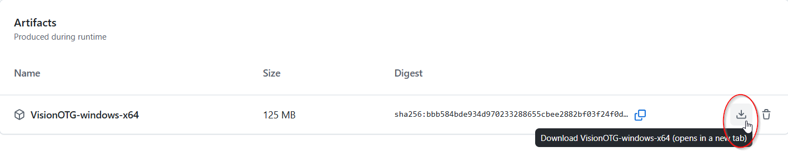
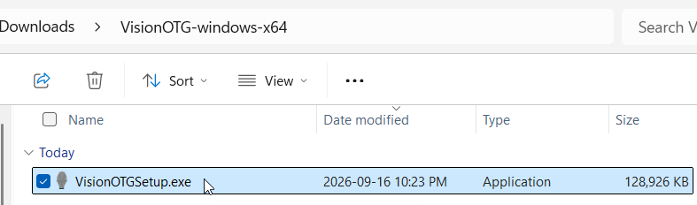
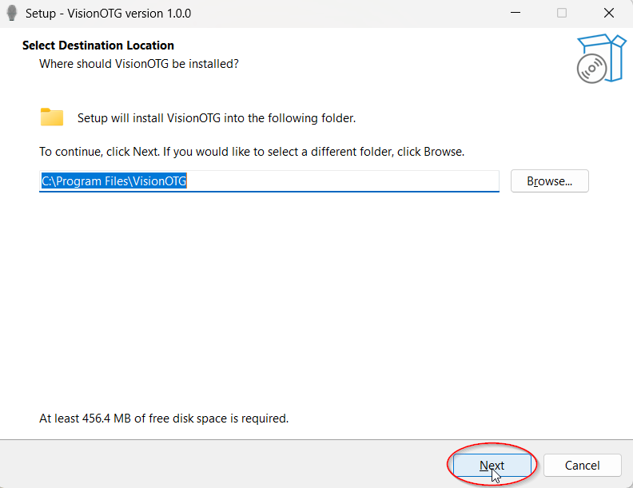
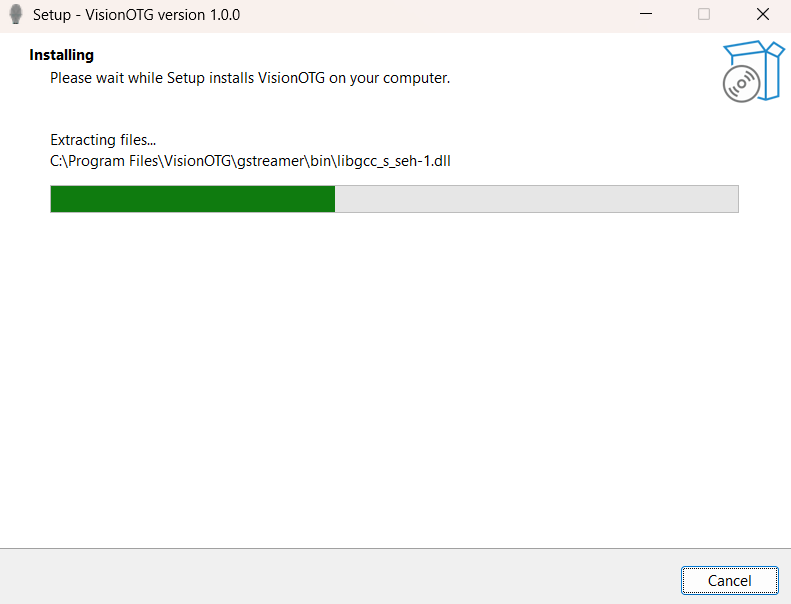
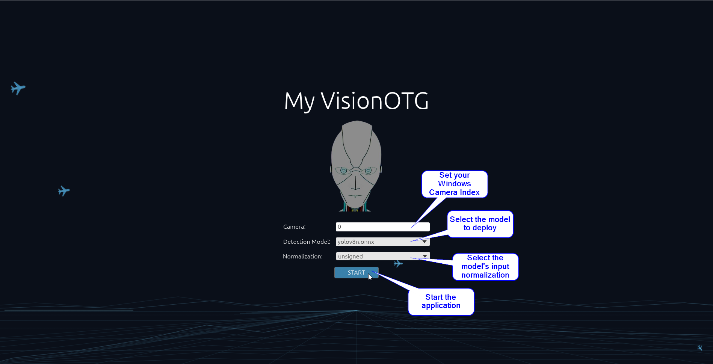
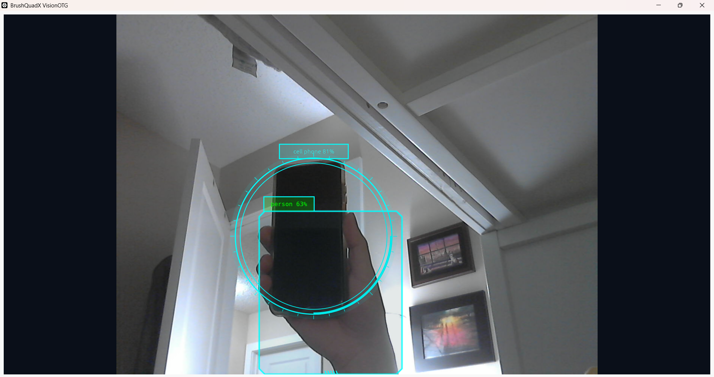
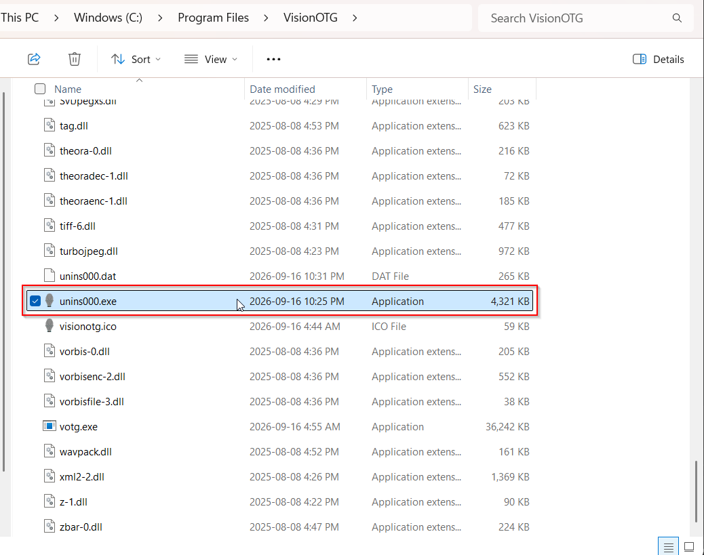
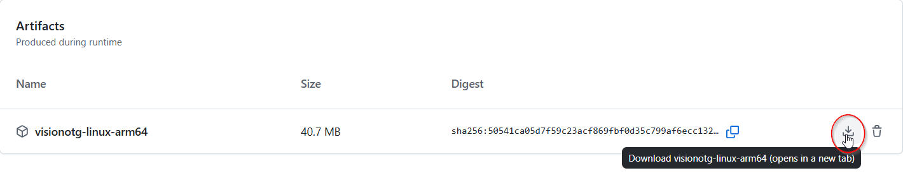
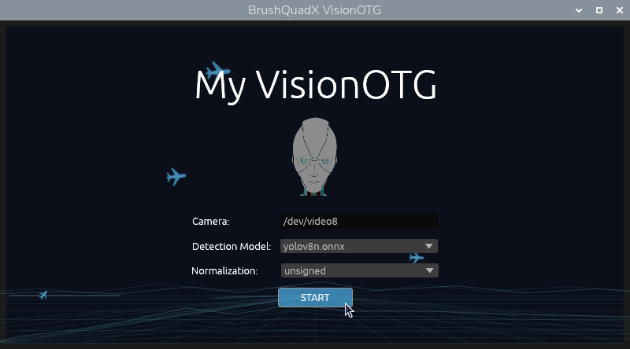
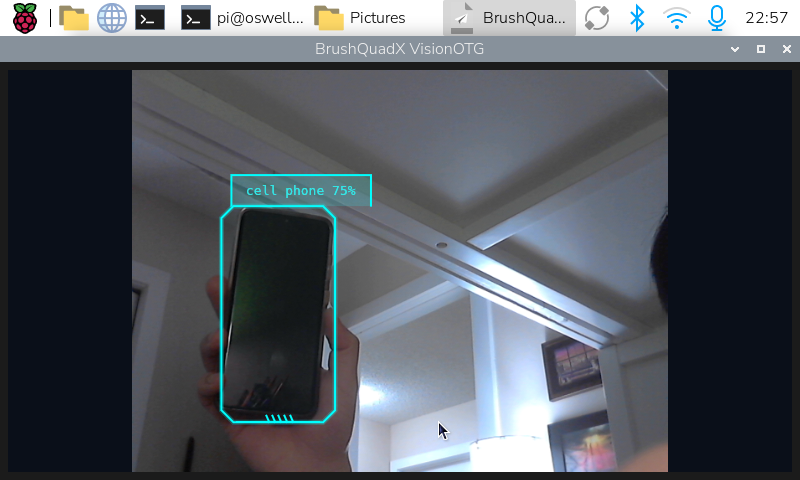

# BrushQuadX VisionOTG

VisionOTG is a native desktop FPV camera application with real-time YOLO object detection. It captures video through GStreamer, runs inference with ONNX Runtime, and renders the camera feed and detection boxes in an `egui` interface.


The project targets:

* Windows 64-bit, packaged with Inno Setup.
* Raspberry Pi 5 64-bit Raspberry Pi OS (`aarch64`), packaged as a Debian package.

## Features

* Live camera preview with configurable camera input.
* GStreamer capture through `v4l2src` on Linux and `mfvideosrc` on Windows.
* YOLO ONNX models with embedded non-maximum suppression.
* Unsigned, signed, and raw input normalization modes.
* Background camera, display, and inference workers so the UI remains responsive.
* Native ARM64 deployment with a packaged ONNX Runtime shared library.

## Installation

### Windows

1. Download the `VisionOTG-windows-x64` package 

    

2. Extract the Zip file

    

3. Go through the setup instructions

    

    

4. Run `votg` application

    

    

    To uninstall the application, run the "unins000.exe" executable.

    

### Linux

1. Download `visionotg-linux-arm64` package

    

2. Extract the file

    ```shell
    $ unzip visionotg-linux-arm64.zip
    Archive:  visionotg-linux-arm64.zip
    inflating: visionotg_1.0.0_arm64.deb
    ```

3. Install the application 

    ```shell
    $ cp ./visionotg_1.0.0_arm64.deb /tmp/
    $ sudo apt install /tmp/visionotg_1.0.0_arm64.deb
    ```

4. Run the application with the command `votg`

    *Note: you can find your Linux camera by running the command `v4l2-ctl --list-devices`.*

    

    

    To uninstall the application, run the following command `sudo apt remove visionotg`.

## Requirements

### Development

* Rust stable and Cargo.
* GStreamer 1.0 development libraries and plugins.
* A compatible ONNX model in `assets/models`.
* Linux builds require an `aarch64` host. The Raspberry Pi packaging scripts are designed for Raspberry Pi 5 rather than cross-compilation.

The exact setup and packaging commands are documented in [BUILD.md](BUILD.md).

### Model

The default model is `yolov8n.onnx`. Models are discovered from `assets/models` during development. Packaged builds place models beside the installed executable or in the Windows bundle, allowing the application to use the same runtime-relative lookup in both cases.

Models should be exported with Ultralytics using embedded NMS and metadata describing a three-channel, `640 x 640` input. See [packaging/model.sh](packaging/model.sh) and [BUILD.md](BUILD.md#convert-model) for the conversion workflow.

### Camera

The default camera is "0" which is typically suitable for Windows computers with a camera attached. Though for Linux machines, it typically follows the form "/dev/video0". To find your camera in Linux run `v4l2-ctl --list-devices`.

## Run From Source

From the repository root:

```shell
cargo run --release
```

On Linux, enter the camera device path in the startup screen, for example `/dev/video0`. On Windows, use the camera index, for example `0`. The application needs access to the camera device and a graphical desktop session.

## Package For Deployment

Windows packaging downloads the required runtime files and creates an installer:

```powershell
powershell -ExecutionPolicy Bypass -File .\packaging\windows\build_windows.ps1
```

Raspberry Pi packaging builds ONNX Runtime and VisionOTG, then creates an ARM64 Debian package:

```shell
chmod +x packaging/linux/*.sh packaging/linux/visionotg-launcher
./packaging/linux/build_deb.sh --setup
```

The resulting package is written to `target/linux-packages`. It installs the application under `/opt/visionotg` and exposes `/usr/bin/votg` as the launcher. For subsequent package-only rebuilds, use `--skip-build` after the release executable and ONNX Runtime library have already been built.

See [BUILD.md](BUILD.md) for setup options, package versions, and installation commands.

## Repository Layout

| Path | Purpose |
| --- | --- |
| `src/votg.rs` | Application entry point and native window setup. |
| `src/app.rs` | Startup controls, camera view, texture updates, and shutdown coordination. |
| `src/camera.rs` | GStreamer pipeline construction and frame worker threads. |
| `src/model.rs` | Model discovery, ONNX Runtime loading, preprocessing, and inference. |
| `src/draw.rs` | Background and detection overlay rendering. |
| `assets/models` | ONNX model files used by the application. |
| `packaging/windows` | Windows runtime download and installer scripts. |
| `packaging/linux` | ARM64 build, Debian packaging, launcher, and desktop entry. |
| `docs` | Additional installation notes. |

## Development Checks

Format Rust code and verify the dependency lockfile is honored:

```shell
cargo fmt
cargo check --locked
```

More detailed design notes are in [ARCHITECTURE.md](ARCHITECTURE.md).
